# Bazhen Mokhovtsov

Backend Developer (Python / Django)

I build production-ready backend systems with clean architecture,
REST APIs, Dockerized environments and monitoring setups.

Find out more about me on my portfolio website.

---

## ⚙️ Tech Stack

- Python
- Django / Django REST Framework
- PostgreSQL
- Redis
- Docker / Docker Compose
- Nginx
- Linux
- GitHub Actions

---

## 🚀 Focus

- Scalable backend systems
- API design
- Service-layer architecture
- Containerized deployments
- Monitoring & observability (Grafana / Prometheus)

---

## 📊 Development Activity

---

## 📈 Metrics

---

## 📫 Contact

Open to backend opportunities in Germany / EU.
